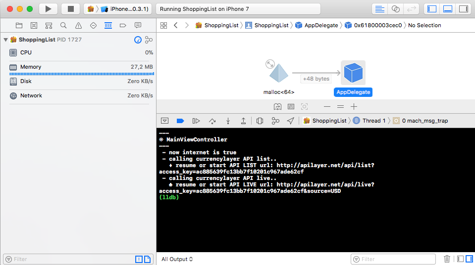

## ShoppingList
>This iOS project can price a simple basket of goods in a number of different currencies.

[](https://developer.apple.com/swift)
[](https://travis-ci.org/Alamofire/Alamofire)
[](https://developer.apple.com/iphone/index.action)

**Demo:**

 

The goods that can be purchased, which are all priced in US$, are:
- Peas: $ 0,95 per bag
- Eggs: $ 2,10 per dozen
- Milk: $ 1,30 per bottle
- Beans: $ 0,73 per can


The program shall allow the user to add or remove items in a basket. The user can click on a checkout button, which will then display the total price for the basket with the option to display the amount in different currencies.

The list of currencies come from http://jsonrates.com/.

- [Features](#features)
- [Testing](#testing)
- [Requirements](#requirements)
- [Communication](#communication)
- [Installation](#installation)
- [Memory managment](#memory-managment)

## Features

- [x] If you set the property ```.rate``` , the basket will calculate automatically the total in the currency rate you have setted.
- [x] If you remove ALL products from your basket you always know the price of each good, in case you decide to not buy a too expensive product for you.
- [x] The network availability is always checked and showed as well as the last currencies update date.

Methods to handling goods in a basket :
```
    - addGood(_ name:String, imageName:String? = nil, amount:Int? = 1, currentPriceForUnity:Double = 0.0, currentCurrency:String? = "USD") 
    - removeGood(_ name:String) 
    - checkGood(_ name:String)->Bool
    - getGood(_ name:String)->Good?
    - calculateQuantity()->Int
    - calculateTotal()->Double

    // You can also simply add a product with addGood("Bread")
```

## Testing
- [x] The ```XCTestCase``` class ```ShoppingListTests``` contains a list of useful methods to test the basket model and the network API calls

## Requirements

- iOS 10.3+
- Xcode 9.2+
- Swift 4.0+
- Universal ( _from iPhone 5 to iPhone X, from iPad 5th gen to iPad Pro 2_ )
- Both orientation available ( portrait  / landscape )

## Communication

- If you **found a bug**, please open an issue.
- If you **have a feature request**, please open an issue.

## Installation

Simply download the project and run it.

## Memory managment

The app don't have **memory leaks** or **retain cycles** according also to the Leaks instrument (Xcode instruments) and the **Debug Memory Graph** (Xcode) as showed in these pictures:

 
 

The ```deinit``` method inside the ```MainViewController``` is called only when the application terminated because it's the **rootViewController** for the initial ```UINavigationController``` and because there aren't other transactions or external interactions besides the checkout button.

So, just only to make this test and verify the correct deallocation of memory during the ```MainViewController``` releasing, I've added a temporary ```UIViewController``` as a **rootViewController** for the initial ```UINavigationController``` with a simple button that push and show the ```MainViewController```.  As you can see, after the tap of the back button to exit from the ```MainViewController```, the ```deinit``` method was called correctly.

 

To avoid the retain cycles of ```self``` inside blocks, according to the [Swift evolution mailing list](https://lists.swift.org/pipermail/swift-evolution/Week-of-Mon-20160118/007425.html), I've used the syntax :
```
[weak self]
guard let `self` = self else { return }
```